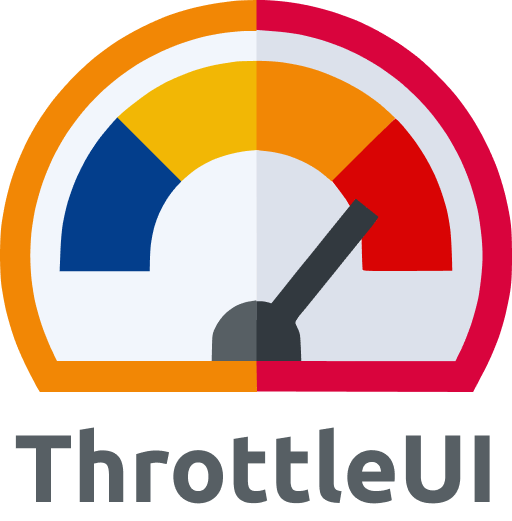

# ThrottleUI

### PT-BR
**ThrottleUI** nasceu da paixão pelas motocicletas e da busca por desempenho, velocidade e precisão—não apenas nas estradas, mas também no desenvolvimento de aplicações web. Assim como uma moto bem ajustada proporciona controle total e resposta imediata, **ThrottleUI** foi projetada para acelerar o processo de desenvolvimento, oferecendo componentes modernos, leves e altamente eficientes. Com um design arrojado e uma experiência suave, a biblioteca permite que desenvolvedores criem interfaces robustas e dinâmicas com menos esforço, mantendo sempre a estabilidade e a performance no mais alto nível.

### EN
**ThrottleUI** was born from a passion for motorcycles and the pursuit of performance, speed, and precision—not just on the road, but also in web application development. Just as a well-tuned bike provides total control and instant responsiveness, **ThrottleUI** is designed to accelerate the development process by offering modern, lightweight, and highly efficient components. With a bold design and a smooth experience, the library enables developers to build robust and dynamic interfaces with less effort, while maintaining top-level stability and performance.